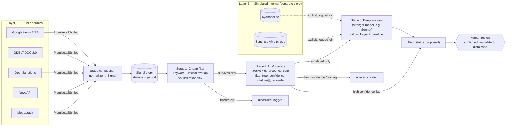
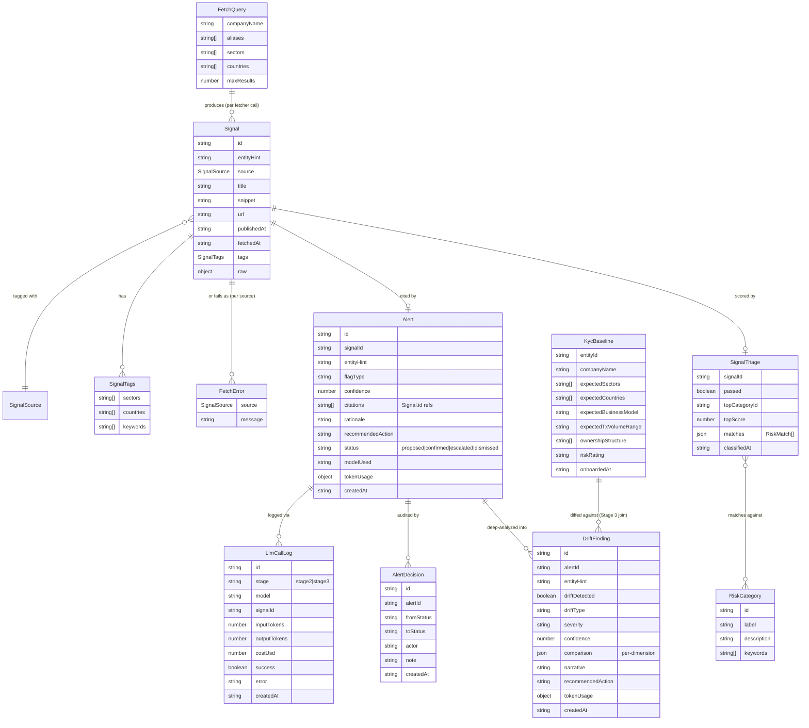

# Architecture — Dynamic Risk Profiling System

## Goal

Combine real-time public intelligence (Layer 1) with a simulated internal KYC/AML profile
(Layer 2) to produce early, explainable, human-reviewable risk alerts — including slow
"KYC drift" that invalidates the assumptions made at onboarding.

## Two data planes

Kept physically separate (separate modules/stores), never merged except through an explicit
join step that's logged and auditable.

- **Layer 1 — Public** (`src/server/signals/`): news, sanctions/watchlists, corporate
  registries, domain/website changes, funding announcements. Non-sensitive, primary focus
  of the build.
- **Layer 2 — Simulated internal** (`src/server/baseline/`): hand-authored KYC baselines, as
  if AMINA had onboarded these entities — expected business model, sectors, jurisdiction,
  ownership, expected transaction volume range, risk rating, onboarding date. Stored in a
  separate `kyc_baselines` table, never merged with the Layer 1 `signals` store; the only join
  is the explicit, logged Stage 3 step. A synthetic AML transaction feed with injected
  anomalies — structuring, cross-border money-mule spike, dormancy break — is also part of
  Layer 2 (`src/server/aml/`, separate `aml_transactions`/`aml_findings` tables); it powers the
  transaction-behavioural reference flags the news/KYC-drift pipeline cannot see (the evidence
  is in transaction patterns, not the news). Detection runs entirely on Layer 2 data, so there
  is no cross-layer leak.

## Pipeline (staged by cost)

```
Ingestion → Stage 1: cheap filter → Stage 2: LLM classify → Stage 3: deep analysis (escalated only)
```

| Stage | What it does | Cost | Status |
| --- | --- | --- | --- |
| 0. Ingestion | Pull raw items from each public source, normalize into `Signal` | API calls only, no LLM | **Built** — `src/server/signals/` |
| 1. Cheap filter | Rule/keyword match + lexical overlap against the risk taxonomy; dedupe (done at ingestion); tag-based routing (see below) | ~free | **Built** — `src/server/filter/` |
| 2. LLM classify | Cheap/fast model (Haiku 4.5) on items that survive Stage 1; structured output: `flag_type, confidence, citations[], rationale, recommended_action` | Low | **Built** — `src/server/classify/` |
| 3. Deep analysis | Stronger model (Sonnet 4.6), escalated cases only; diffs the flagged signal against the Layer 2 KYC baseline to detect drift; produces case narrative | Higher, but rare | **Built** — `src/server/classify/stage3.ts` |

Every LLM call is logged with token counts so the system can report cost per 1,000 alerts
and the % of volume resolved at each stage without an LLM call — this is what's judged
under "Cost Efficiency."

### Pipeline flowchart



### Backend module flowchart

```mermaid
flowchart TD
    CLIENT[Client request] --> ROUTE["src/app/api/signals/route.ts\n(thin: parse params, call server, return JSON)"]
    ROUTE --> IDX["src/server/signals/index.ts\nfetchAllSignals(query)"]
    IDX -->|"concurrent, allSettled"| F1[googleNewsRss.ts]
    IDX -->|"concurrent, allSettled"| F2[gdelt.ts]
    IDX -->|"concurrent, allSettled"| F3[openSanctions.ts]
    IDX -->|"concurrent, allSettled"| F4[newsapi.ts]
    IDX -->|"concurrent, allSettled"| F5[mediastack.ts]
    F1 & F2 & F3 & F4 & F5 -->|Signal\[\] or rejected| IDX
    IDX -->|"signals[], errors[]"| STOREMOD["store.ts\nupsertSignals(): dedupe by\nnormalized URL + fuzzy title/day"]
    STOREMOD --> MEM[("Postgres\nsignals table")]
    IDX -->|"inserted signals"| STAGE1MOD["filter/index.ts\nrunStage1(): keyword + lexical\nscore vs. risk taxonomy"]
    STAGE1MOD --> MEM2[("Postgres\nsignal_triage")]
    STOREMOD --> ROUTE
    ROUTE --> CLIENT

    CLIENT2[Client request] --> GENROUTE["src/app/api/alerts/generate/route.ts"]
    GENROUTE --> S2MOD["classify/index.ts\nrunStage2(): Stage-1 survivors\nwithout an alert"]
    S2MOD -->|"one signal per call"| LLM["classify/stage2.ts\nAnthropic SDK, forced tool call,\nZod validation, retry once"]
    LLM -->|"Stage2Output or null"| S2MOD
    S2MOD -->|"every call, success or failure"| LOGMOD["classify/store.ts\nlogLlmCall()"]
    LOGMOD --> MEM3[("Postgres\nllm_calls")]
    S2MOD -->|"valid output only"| ALERTMOD["classify/store.ts\ncreateAlert(): always status='proposed'"]
    ALERTMOD --> MEM4[("Postgres\nalerts")]
    GENROUTE --> CLIENT2

    CLIENT3[Analyst] -->|"PATCH /api/alerts/:id"| PATCHROUTE["src/app/api/alerts/[id]/route.ts"]
    PATCHROUTE --> SETSTATUS["classify/store.ts\nsetAlertStatus(): only caller\nallowed to change status\n+ writes audit row"]
    SETSTATUS --> MEM4
    SETSTATUS --> MEM5[("Postgres\nalert_decisions")]

    CLIENT4[Analyst] -->|"POST /api/alerts/:id/analyze"| ANALYZE["src/app/api/alerts/[id]/analyze/route.ts"]
    ANALYZE --> S3MOD["classify/index.ts\nrunStage3(): explicit Layer1×Layer2 join"]
    MEM4 -.->|alert + signal| S3MOD
    BASE[("Postgres\nkyc_baselines\n(Layer 2, separate store)")] -.->|baseline| S3MOD
    S3MOD -->|"one call"| LLM3["classify/stage3.ts\nSonnet 4.6, forced tool call,\nZod validation, retry once"]
    LLM3 --> LOGMOD
    S3MOD -->|"drift finding"| MEM6[("Postgres\ndrift_findings")]
    ANALYZE --> CLIENT4
```

### Schema graph



## Stage 1: cheap filter

`src/server/filter/` scores every newly-ingested signal against a risk taxonomy
(`taxonomy.ts` — 11 categories: sanctions, adverse media, financial distress, cyber
incident, regulatory/legal action, ownership/control change, leadership change, business
model drift, jurisdiction risk, litigation, PEP exposure). Not sourced from a specific
challenge spec — a reasonable default KYC/AML category set, freely editable.

Scoring (`stage1.ts`) is two free, non-LLM signals combined per category, then maxed:

- **Keyword match** — exact-phrase hits against each category's keyword list. Any single
  hit scores ≥0.5 (strong, explainable evidence) with diminishing returns for more hits.
- **Lexical overlap** — token-set Jaccard similarity between the signal text and the
  category's description+keywords, capped at 0.45. This is the free, dependency-free stand-in
  for "local embeddings" mentioned in the original pipeline sketch — it catches paraphrases
  a strict keyword match misses (e.g. "stepped down as CEO" vs. the keyword "ceo resigns")
  without the cost/latency/deploy complexity of running an actual embedding model. If recall
  proves too low in practice, swapping `classifySignal()` for a real local embedding model
  (e.g. transformers.js) is a drop-in change — call sites only depend on the resulting score.

A signal **passes** (is eligible for Stage 2) if its top category score is ≥0.3. Results are
persisted per-signal in a separate `signal_triage` table (`filter/store.ts`) keyed
to `signals.id`, not merged into the Stage 0 `signals` table — keeps each stage's output
independently auditable, consistent with the "every LLM flag must cite a real Signal.id"
guardrail below. `GET /api/signals/store?stage1=survived|filtered` exposes the split.

## Stage 2: LLM classify

`src/server/classify/` runs Claude Haiku 4.5 over Stage-1-survivor signals that don't yet
have an alert (`runStage2()` in `classify/index.ts`). One signal per call — this keeps
grounding trivial to enforce (citations can only reference the one signal id given) rather
than trusting the model's claimed sources. Triggered explicitly via
`POST /api/alerts/generate`, never automatically on ingest, so every dollar spent is a
deliberate action — Stage 1 already did the free triage.

**Structured output, enforced, not requested.** The model must respond via a forced tool call
(`tool_choice: {type: "tool", name: "submit_risk_assessment"}`) with `flagType` (taxonomy id),
`confidence`, `citationSignalIds`, `rationale`, `recommendedAction`. The response is validated
with Zod (`classify/types.ts`) and the citation ids are checked against the actual signal id
given to the model — not trusted. On either failure, the call retries once with the validation
error appended to the conversation; if the retry also fails, no `Alert` is created and the
failure is still logged via `logLlmCall()` (`classify/store.ts`) — per the guardrail below,
this is reject/retry, never silent acceptance of malformed output.

**Every Alert is created with `status: "proposed"`** — `createAlert()` has no parameter to set
any other status; the only function that can change it is `setAlertStatus()`, called solely
from the human-initiated `PATCH /api/alerts/:id` route. Nothing in the ingestion or
Stage 1/2 pipeline calls it. This is the human-in-the-loop guardrail in code, not just policy.

**Every LLM call is logged**, success or failure, via `logLlmCall()` into a separate
`llm_calls` table (model, signal id, input/output tokens, cost estimate, error if any) —
`GET /api/cost-summary` aggregates this into the cost-per-1000-alerts metric the judging
criteria call for. Token costs are computed from the pricing in `classify/stage2.ts`
(Haiku 4.5: $1.00/1M input, $5.00/1M output as of this build — update if pricing changes).

## Data model

```ts
Signal {
  id, entityHint, source, mergedSources?, title, snippet?, url,
  publishedAt, fetchedAt, tags: { sectors[], countries[], keywords[] }, raw?
}

Stage1Classification {
  passed, topMatch: { categoryId, categoryLabel, score, matchedKeywords[] } | null,
  matches: RiskMatch[], classifiedAt
}

Alert {
  id, signalId, entityHint, flagType, confidence, citations: SignalId[],
  rationale, recommendedAction, status: "proposed" | "confirmed" | "escalated" | "dismissed",
  modelUsed, tokenUsage: { inputTokens, outputTokens, costUsd }, createdAt
}

LlmCallLog {
  id, stage: "stage2" | "stage3", model, signalId,
  inputTokens, outputTokens, costUsd, success, error, createdAt
}

AlertDecision {        // append-only audit of human status changes
  id, alertId, fromStatus, toStatus, actor, note?, createdAt
}

// Layer 2 — separate store (src/server/baseline/), joined to Layer 1 only in Stage 3
KycBaseline {
  entityId, companyName, expectedSectors[], expectedCountries[],
  expectedBusinessModel, expectedTxVolumeRange, ownershipStructure[],
  riskRating, onboardedAt
}

DriftFinding {         // Stage 3 output, per analyzed alert
  id, alertId, entityHint, driftDetected, driftType, severity, confidence,
  comparison: { dimension, expected, observed, changed }[],
  narrative, recommendedAction, citationSignalIds: SignalId[],
  modelUsed, tokenUsage, createdAt
}
```

## Entity Tagging & Routing

**Design decision:** at onboarding, tag each client with the sectors, countries, and
keywords relevant to their business (these are largely just fields already present in the
KYC baseline — sector and jurisdiction are KYC questions anyway, so this isn't extra data
entry). Incoming Layer 1 signals are tagged the same way at ingestion (see `SignalTags` in
`types.ts`). Routing a new signal to candidate clients becomes a tag-intersection lookup
instead of running every client's name through every source on every poll.

This is the right default for the **macro/sector-level** half of monitoring — e.g. "EU
regulatory crackdown on crypto exchanges" should reach every crypto+EU-tagged client without
anyone having queried for it by name, and that's a real query pattern compliance teams want
("what changed in my book of business," not just "what changed for client X").

Two things to add so it doesn't create gaps:

1. **Pair it with direct named-entity search, not instead of it.** Tags are a recall net for
   macro signals; they don't guarantee a hit on news that's specifically about a client by
   name but doesn't carry an obvious sector/country tag (e.g. a niche local news item).
   Keep a per-client scheduled query by company name + known aliases (what the current
   fetchers already do) running alongside tag-based routing — Stage 1 should accept signals
   from either path.
2. **A tag mismatch is itself a drift signal, not just a filter.** If a client's news
   footprint stops matching their onboarding tags — e.g. tagged `sector:saas` but recent
   coverage is consistently `sector:crypto` — that pattern *is* "Material Business Model
   Change" / "Business Activity Change Signal" from the challenge's flag table. Worth
   building this as an explicit Stage 3 check (compare the tag distribution of a client's
   last N matched signals against their baseline tags) rather than only using tags as a
   pre-filter.

One risk to watch in the demo: coarse tags (e.g. `country:US`) over-match at GDELT/news
volume. Keep tags specific (sector taxonomy with enough granularity, not just NAICS-2-digit)
and lean on Stage 1's keyword/lexical filter to cut volume back down before anything
reaches an LLM.

### Scaling GDELT beyond a handful of clients

The current `gdelt.ts` fetcher queries by company name per client — fine for a demo, but it
won't scale to a real client book against GDELT's informal rate limits (250 records/query,
soft-throttled shared IPs). Two changes, in order of priority:

1. **Query by sector/country tag-pair, not by client.** One `theme:`-filtered query per
   active tag combination covers every client sharing it, instead of N per-client queries.
   GDELT's DOC 2.0 API supports a `theme:` operator (e.g. `theme:CYBER_ATTACK`,
   `theme:WB_2670_SANCTIONS`) that matches GDELT's own GKG theme tagging — already computed
   server-side, so this is still a single `fetch()` call per query, no bulk download or
   local filtering required. Map each sector in the KYC taxonomy to a small set of theme
   codes (see lookup below) rather than inventing freetext keyword lists per sector.
   Keep per-client named-entity search alongside this for the long tail (point 1 above).
2. **Bulk GKG files, only if query volume outgrows the DOC API.** GDELT publishes raw
   GKG/events files every 15 minutes at `data.gdeltproject.org/gdeltv2/`. Fetching one global
   file per interval and filtering it locally against all client tags avoids per-entity API
   calls entirely, but adds real parsing complexity (large TSV, different schema). Not worth
   building for the hackathon demo — DOC API + tag-batched theme queries covers it.

Reference docs: [DOC 2.0 API query syntax](https://blog.gdeltproject.org/gdelt-doc-2-0-api-debuts/),
[GKG Codebook V2.1](http://data.gdeltproject.org/documentation/GDELT-Global_Knowledge_Graph_Codebook-V2.1.pdf)
(theme taxonomy reference), [GKG theme code lookup list](https://blog.gdeltproject.org/new-november-2021-gkg-2-0-themes-lookup/).

## Exposure graph & second-order propagation (Layer 1)

`src/server/exposure/` makes the flat `SignalTags` into a normalized, typed
**exposure graph**: one row per edge `(entityName, tagType, tagValue)` in
`entity_exposures`, where `tagType ∈ sector | country | director | supplier |
customer | subsidiary | regulator`. Every value is a *public* fact (registry /
news / onboarding questionnaire), so the whole module is Layer 1.

**Layer separation is enforced by the database, not convention.** The table has a
`layer TEXT NOT NULL DEFAULT 'public' CHECK (layer = 'public')` constraint, and
beneficial ownership / UBO is deliberately *not* a tag type — it stays sensitive
Layer 2 data in `KycBaseline.ownershipStructure`. An internal edge physically
cannot be written here.

**Second-order propagation** (`propagate.ts`) is the payoff: a public signal can
endanger a client it never names, by hitting one of the client's exposure edges
(a shared director, supplier, …). Staged by cost like the rest of the pipeline:

1. **Free pre-filter** — only edges whose `tagValue` literally appears in the
   signal text (word-boundary match) become candidates; coarse `sector`/`country`
   edges are excluded from propagation (`PROPAGATABLE_TAG_TYPES`) to avoid
   over-matching at news volume. No LLM is spent on the long tail.
2. **LLM materiality judgement** (Haiku 4.5, stage `exposure`) — decides whether
   the mention is a genuine, material risk to the *client* (vs. a tangential
   mention), with reasoning + confidence, grounded to the signal id. Runs through
   the shared harness, so every call (incl. "not material" verdicts) is
   token-logged. First-order coverage stays Stage 2's job — propagation skips
   edges back to the signal's own entity.

Each `exposure_alert` is created `status: 'proposed'`; `setExposureAlertStatus()`
is the only status-change path and writes an `exposure_alert_decisions` audit row
— the same human-in-the-loop guardrail as the news and AML sides. The citation
chain is fully explainable: `Signal.id → exposure edge (tagValue, tagType) →
client`. Demo hook: "Markus Braun" is seeded as a director of both Wirecard and
the synthetic shell *Lindenhof Holdings AG*, so adverse media about Braun
(ingested while monitoring Wirecard) raises an exposure alert on Lindenhof — a
client with no public footprint, now flagged on two independent axes (this and
the AML dormancy break).

## Transaction investigation view

AMINA is a crypto bank, so a concerning client's full picture spans two planes:
its **internal** AMINA transactions (Layer 2, `aml_transactions`) and its
**public on-chain** activity for known wallet addresses (Layer 1). These are
*different layers* — public-ledger data must never be merged into the internal
feed — so they live in separate stores: `src/server/onchain/` (own
`onchain_transactions` table, entity→address bridge in `addresses.ts`). They meet
only at the **read-only investigation display join** (`src/server/investigation/`),
exactly like the dashboard join.

The hard part is "everything on display without overwhelming," so
`buildInvestigation()` returns a **progressive-disclosure** shape rather than a
raw ledger: lead with the 1–3 `findings`; aggregate counterparty `flows` (sized
by volume — the anomaly is a *shape*); expand only the `evidence` transactions; a
merged internal+on-chain `timeline` defaulted to the anomaly window with evidence
rows highlighted and the cap ordered so a flagged row is never dropped; and full
`ledger` counts/totals for "show me everything" on demand. The synthetic on-chain
feed injects anomalies in the *same window* as the internal AML flags (Binance →
sanctioned-mixer inflow; Lindenhof → high-risk inflow in the dormancy window) so
the public ledger visibly corroborates the internal finding. `narrate.ts`
(Haiku 4.5, stage `investigate`) is an optional on-demand summary across both
planes, grounded to the transaction ids shown and token-logged via the shared
harness.

## Shared LLM harness

`src/server/llm/structured.ts` (`callStructuredLlm`) centralizes the CLAUDE.md
non-negotiables so they're structural, not per-call discipline: forced tool call
(structured output), one retry on schema/grounding failure then reject, and
exactly one `llm_calls` row per invocation (success or failure) — there is no way
to call the model from a feature without its cost being logged. The caller passes
a `parse` callback that runs its Zod schema and checks citations against the real
evidence set. New stages (`tag_extract`, `exposure`, `investigate`) are added to
the `LlmStage` union, so their spend rolls into the cost-per-1000-alerts metric.
(Stage 2/3 and AML narration predate this helper and already implement the same
contract by hand.)

## Guardrails

- **Data separation (implemented):** Layer 1 (`src/server/signals/`, `signals` table) and
  Layer 2 (`src/server/baseline/`, `kyc_baselines` table) are separate modules and stores.
  They meet only in `classify/stage3.ts`, which explicitly fetches the alert/signal and the
  baseline and combines them in one prompt — a single, logged join (via `llm_calls`). The
  exposure graph (`entity_exposures`) and public on-chain feed (`onchain_transactions`) are
  additional **Layer 1** stores; `entity_exposures.layer` carries a `CHECK (layer = 'public')`
  constraint so an internal edge cannot be written, and the public on-chain feed meets the
  Layer 2 internal feed only at the read-only investigation join.
- **Grounding (implemented):** every `Alert.citations` entry must reference a real `Signal.id`
  that was actually ingested — `classify/stage2.ts` checks this against the signal actually
  given to the model, not the model's claim, and rejects/retries on a bad citation.
- **Schema enforcement (implemented):** Stage 2 output is validated with Zod
  (`classify/types.ts`); violation → retry once, then give up without creating an `Alert` —
  never silent acceptance of malformed output.
- **Human-in-the-loop (implemented):** `createAlert()` always sets `status: "proposed"`;
  `setAlertStatus()` is the only function that can change it, called solely from the
  human-initiated `PATCH /api/alerts/:id` route. No automated action is taken directly off a
  model output.
- **Entity grounding (implemented):** Stage 2 also judges `concernsEntity` — whether the
  signal is actually about the searched entity vs. a same-name company / person / passing
  mention — and `runStage2` suppresses the alert when it isn't, guarding against acting on
  the wrong entity (the entityHint is only a search hint, not a verified match).
- **RBAC stub:** analyst vs. compliance-officer roles gating who can change alert status. Not
  yet built — `PATCH /api/alerts/:id` records the acting `actor` but doesn't enforce a role.
- **Audit log (implemented):** every LLM call (model, tokens, cost, success/failure) is
  logged via `logLlmCall()` into `llm_calls`, regardless of outcome. Every human status change
  writes an append-only `alert_decisions` row (actor, from→to, note, timestamp) in the same
  transaction as the update, so status and audit trail can't disagree.

## Current implementation

The full pipeline (Stage 0 → 1 → 2 → 3) and both data layers exist today:

- `src/server/db.ts` — Postgres connection pool (`getPool()`, reads `DATABASE_URL`) and
  `defineSchema(ddl)`, which applies each store's DDL once, lazily, on first request (no
  migration framework); stores call this instead of repeating the promise-caching dance
- `src/server/anthropic.ts` — Anthropic client singleton + per-model token-cost helpers
- `src/server/signals/types.ts` — `Signal`, `SignalTags`, `FetchQuery`, `FetchError`
- `src/server/signals/fetchers/{googleNewsRss,gdelt,openSanctions,newsapi,mediastack,crunchbase}.ts`
  — `crunchbase.ts` adds funding/registry intelligence (ownership + business-model drift
  signals); it uses the real Crunchbase v4 API when `CRUNCHBASE_API_KEY` is set and otherwise
  emits a deterministic *synthetic* funding feed (flagged `raw.synthetic = true`, stable URLs)
  so the source still runs end-to-end in the demo
- `src/server/signals/helpers.ts` — `buildSearchTerm`/`buildKeywordList`/`toSignal`, shared by
  the fetchers so the query syntax and normalized `Signal` shape live in one place
- `src/server/signals/store.ts` — Postgres-backed dedupe store (embedded DDL is the single
  source of truth, applied automatically on first request); `upsertSignals()` keys on a unique index on
  normalized URL with a fuzzy normalized-title+day fallback to catch the same story
  reported by different sources under different URLs
- `src/server/signals/index.ts` — `fetchAllSignals()` runs all fetchers concurrently via
  `Promise.allSettled`, merges results and per-source errors; `ingestSignals()` wraps that,
  upserts into the store, and runs the result through Stage 1
- `src/server/filter/taxonomy.ts` — the 11-category risk taxonomy
- `src/server/filter/stage1.ts` — `classifySignal()`, the keyword + lexical-overlap scorer
- `src/server/filter/store.ts` — persists each signal's classification to
  `signal_triage`, keyed to `signals.id`
- `src/server/filter/index.ts` — `runStage1()` (classify + persist a batch),
  `attachStage1Classifications()` (join classifications onto already-stored signals)
- `src/app/api/signals/route.ts` — `GET /api/signals?company=...&sectors=...&countries=...`,
  returns newly-seen signals (each with its Stage 1 result) + duplicate count + a
  `{ survived, filtered }` Stage 1 summary
- `src/app/api/signals/store/route.ts` — `GET /api/signals/store?entityHint=...&stage1=survived|filtered`,
  lists everything accumulated in the store so far, annotated with Stage 1 results
- `src/server/filter/store.ts` also exports `getTriageStats()` — Stage-1 volume resolved
  vs. passed, for the cost-efficiency metric
- `src/server/classify/types.ts` — `Stage2OutputSchema`/`Stage3OutputSchema` (Zod), `Alert`,
  `DriftFinding`, `AlertDecision`, `LlmCallLog` types
- `src/server/classify/stage2.ts` — `classifySignalWithLlm()` (Haiku 4.5, forced tool call,
  Zod + citation validation, `concernsEntity` guard, corroboration in prompt, retry once);
  exports `buildStage2Request`/`validateStage2` shared with the batch path
- `src/server/classify/stage3.ts` — `analyzeDrift()` (Sonnet 4.6), the Layer 1 × Layer 2 diff
- `src/server/classify/batch.ts` — `submitStage2Batch()`/`collectStage2Batch()`, the opt-in
  Message Batches path (50% cheaper, async)
- `src/server/classify/citations.ts` — `resolveCitations()`, expands Signal.ids to title+url
- `src/server/classify/store.ts` — persists `alerts`, `llm_calls`, `alert_decisions`,
  `drift_findings`; `createAlert()` always writes `status: 'proposed'`; `setAlertStatus()` is
  the only status-change path and writes an audit row in the same transaction; `getCostSummary()`
  aggregates spend + triage breakdown
- `src/server/classify/index.ts` — `runStage2()` (classify survivors, suppress wrong-entity,
  log every call) and `runStage3()` (the explicit baseline join)
- `src/server/baseline/{types,store,seed,index}.ts` — Layer 2 KYC baselines in a separate
  `kyc_baselines` store; `getBaselineByCompany()` is the Stage 3 join key
- `src/app/api/alerts/generate/route.ts` — `POST …?entityHint=…&limit=…[&mode=batch]`, the
  only LLM-calling endpoint, triggered explicitly
- `src/app/api/alerts/batch/[id]/collect/route.ts` — `POST`, collect a Stage 2 batch
- `src/app/api/alerts/route.ts` — `GET /api/alerts?entityHint=…&status=…`
- `src/app/api/alerts/[id]/route.ts` — `GET` (full detail: citations, drift, decisions),
  `PATCH` (human-in-the-loop status change, requires `actor`, writes audit row)
- `src/app/api/alerts/[id]/analyze/route.ts` — `POST`, runs Stage 3 drift analysis
- `src/app/api/baselines/route.ts` + `baselines/seed/route.ts` — list / seed KYC baselines
- `src/app/api/cost-summary/route.ts` — `GET`, spend + cost-per-1000-alerts + % resolved without LLM
- `src/app/alerts/page.tsx` + `src/components/alerts-view.tsx` — the alerts console UI
- `src/server/baseline/profileStore.ts` + `profileSeed.ts` — Layer 2 *synthetic* relationship
  profile (relationship type, exposure, relationship manager, watchlist status) in its own
  `client_profiles` table; internal data, never merged into the Layer 1 `signals` store
- `src/server/dashboard/{types,index}.ts` — `buildClientRecords()`, the explicit **read-only**
  Layer 1 × Layer 2 join that assembles the frontend's `ClientRecord` shape (KYC baseline +
  client profile + ingested signals + highest-confidence alert + its Stage 3 drift). No LLM,
  writes nothing back — the two planes meet only in named, auditable join steps (this for
  display, Stage 3 for analysis)
- `src/app/api/dashboard/route.ts` — `GET`, the client book as `ClientRecord[]`;
  `dashboard/snapshot/route.ts` — `POST`, writes that book to `src/app/data.json`, the static
  file the (unchanged) frontend imports. This is the backend↔frontend seam: the UI keeps
  importing JSON; the snapshot endpoint makes that JSON reflect real DB state on demand
- `src/app/api/seed/route.ts` — `POST`, one-shot demo bootstrap: seed baselines + profiles,
  then ingest Layer 1 signals (incl. Crunchbase) per entity through Stage 1. No LLM calls
- `src/server/aml/{types,store,feed,detect,narrate,index}.ts` — Layer 2 AML transaction
  monitoring. `feed.ts` generates a deterministic synthetic transaction feed with injected
  anomalies (Binance → money-mule cross-border spike, Wirecard → structuring, the synthetic
  shell *Lindenhof Holdings AG* → dormancy break; Tesla/Nestle clean as false-positive
  controls). `detect.ts` is the free, Stage-1-analog rule engine (the 3 behavioural flags),
  each finding grounded in the exact transaction ids that triggered it. `narrate.ts` is the
  optional Stage-2-analog Haiku narration (reasons over flagged tx + KYC baseline, citations
  checked against the evidence set, token-logged via `logLlmCall(stage:'aml')`). Findings are
  always created 'proposed'; `setFindingStatus()` is the only status-change path and writes an
  `aml_finding_decisions` audit row — the same human-in-the-loop guardrail as the news side
- `src/app/api/aml/{seed,detect}/route.ts`, `aml/findings/route.ts`,
  `aml/findings/[id]/route.ts` (GET + human-in-the-loop PATCH), `aml/findings/[id]/narrate/route.ts`
- The dashboard join (`src/server/dashboard/`) folds the top AML finding into each client's
  record: it adds a "Behavioural / AML Risk" breakdown row and drives the headline severity/flag
  when it outranks the news alert — so the transaction-behavioural flags surface in the
  unchanged frontend (Lindenhof, with no public footprint, is flagged on AML evidence alone)

See README.md for setup, and the "Next steps" list there for what's still to build.
