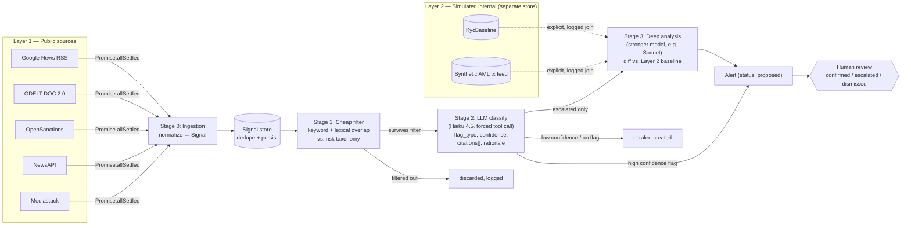
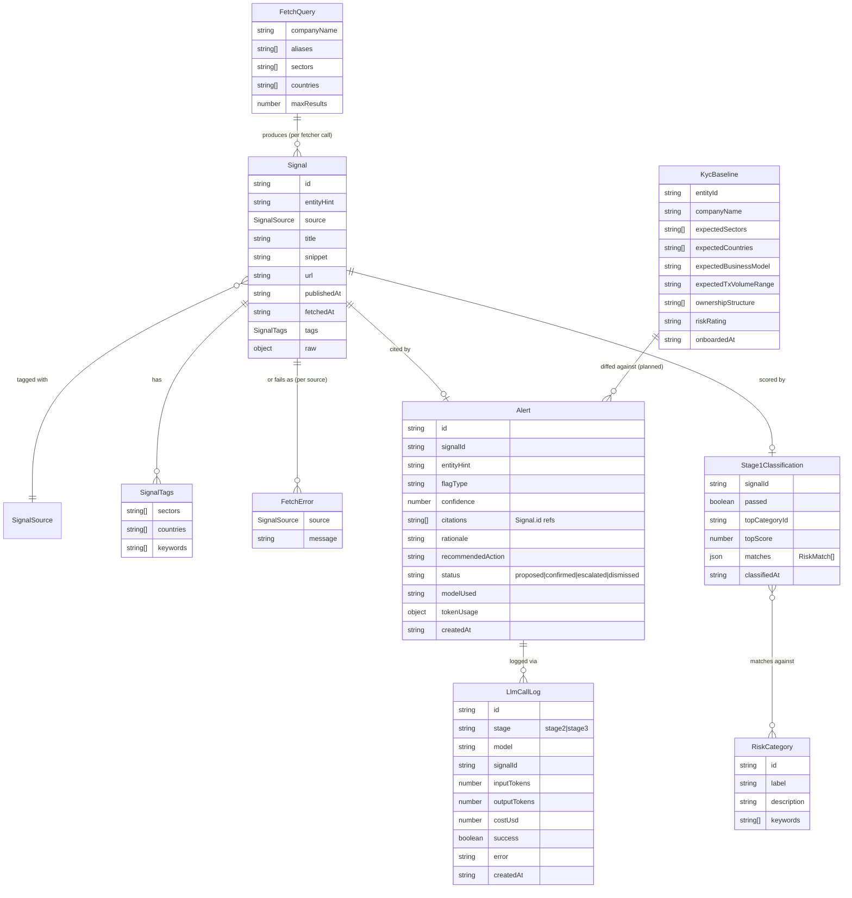

# Architecture — Dynamic Risk Profiling System

## Goal

Combine real-time public intelligence (Layer 1) with a simulated internal KYC/AML profile
(Layer 2) to produce early, explainable, human-reviewable risk alerts — including slow
"KYC drift" that invalidates the assumptions made at onboarding.

## Two data planes

Kept physically separate (separate modules/stores), never merged except through an explicit
join step that's logged and auditable.

- **Layer 1 — Public** (`src/server/signals/`): news, sanctions/watchlists, corporate
  registries, domain/website changes, funding announcements. Non-sensitive, primary focus
  of the build.
- **Layer 2 — Simulated internal** (not yet built): a hand-authored KYC baseline for one
  real company, as if AMINA had onboarded them — expected business model, jurisdiction,
  ownership, expected transaction volume/pattern, risk rating — plus a synthetic AML
  transaction feed with a few injected anomalies (structuring, sudden cross-border spike,
  dormancy break).

## Pipeline (staged by cost)

```
Ingestion → Stage 1: cheap filter → Stage 2: LLM classify → Stage 3: deep analysis (escalated only)
```

| Stage | What it does | Cost | Status |
| --- | --- | --- | --- |
| 0. Ingestion | Pull raw items from each public source, normalize into `Signal` | API calls only, no LLM | **Built** — `src/server/signals/` |
| 1. Cheap filter | Rule/keyword match + lexical overlap against the risk taxonomy; dedupe (done at ingestion); tag-based routing (see below) | ~free | **Built** — `src/server/filter/` |
| 2. LLM classify | Cheap/fast model (Haiku 4.5) on items that survive Stage 1; structured output: `flag_type, confidence, citations[], rationale, recommended_action` | Low | **Built** — `src/server/classify/` |
| 3. Deep analysis | Stronger model (e.g. Sonnet), escalated cases only; diffs Stage 2 extractions against the Layer 2 baseline to detect drift; produces case narrative | Higher, but rare | Not built |

Every LLM call is logged with token counts so the system can report cost per 1,000 alerts
and the % of volume resolved at each stage without an LLM call — this is what's judged
under "Cost Efficiency."

### Pipeline flowchart



### Backend module flowchart

```mermaid
flowchart TD
    CLIENT[Client request] --> ROUTE["src/app/api/signals/route.ts\n(thin: parse params, call server, return JSON)"]
    ROUTE --> IDX["src/server/signals/index.ts\nfetchAllSignals(query)"]
    IDX -->|"concurrent, allSettled"| F1[googleNewsRss.ts]
    IDX -->|"concurrent, allSettled"| F2[gdelt.ts]
    IDX -->|"concurrent, allSettled"| F3[openSanctions.ts]
    IDX -->|"concurrent, allSettled"| F4[newsapi.ts]
    IDX -->|"concurrent, allSettled"| F5[mediastack.ts]
    F1 & F2 & F3 & F4 & F5 -->|Signal\[\] or rejected| IDX
    IDX -->|"signals[], errors[]"| STOREMOD["store.ts\nupsertSignals(): dedupe by\nnormalized URL + fuzzy title/day"]
    STOREMOD --> MEM[("Postgres\nsignals table")]
    IDX -->|"inserted signals"| STAGE1MOD["filter/index.ts\nrunStage1(): keyword + lexical\nscore vs. risk taxonomy"]
    STAGE1MOD --> MEM2[("Postgres\nsignal_triage")]
    STOREMOD --> ROUTE
    ROUTE --> CLIENT

    CLIENT2[Client request] --> GENROUTE["src/app/api/alerts/generate/route.ts"]
    GENROUTE --> S2MOD["classify/index.ts\nrunStage2(): Stage-1 survivors\nwithout an alert"]
    S2MOD -->|"one signal per call"| LLM["classify/stage2.ts\nAnthropic SDK, forced tool call,\nZod validation, retry once"]
    LLM -->|"Stage2Output or null"| S2MOD
    S2MOD -->|"every call, success or failure"| LOGMOD["classify/store.ts\nlogLlmCall()"]
    LOGMOD --> MEM3[("Postgres\nllm_calls")]
    S2MOD -->|"valid output only"| ALERTMOD["classify/store.ts\ncreateAlert(): always status='proposed'"]
    ALERTMOD --> MEM4[("Postgres\nalerts")]
    GENROUTE --> CLIENT2

    CLIENT3[Analyst] -->|"PATCH /api/alerts/:id"| PATCHROUTE["src/app/api/alerts/[id]/route.ts"]
    PATCHROUTE --> SETSTATUS["classify/store.ts\nsetAlertStatus(): only caller\nallowed to change status"]
    SETSTATUS --> MEM4
```

### Schema graph



## Stage 1: cheap filter

`src/server/filter/` scores every newly-ingested signal against a risk taxonomy
(`taxonomy.ts` — 11 categories: sanctions, adverse media, financial distress, cyber
incident, regulatory/legal action, ownership/control change, leadership change, business
model drift, jurisdiction risk, litigation, PEP exposure). Not sourced from a specific
challenge spec — a reasonable default KYC/AML category set, freely editable.

Scoring (`stage1.ts`) is two free, non-LLM signals combined per category, then maxed:

- **Keyword match** — exact-phrase hits against each category's keyword list. Any single
  hit scores ≥0.5 (strong, explainable evidence) with diminishing returns for more hits.
- **Lexical overlap** — token-set Jaccard similarity between the signal text and the
  category's description+keywords, capped at 0.45. This is the free, dependency-free stand-in
  for "local embeddings" mentioned in the original pipeline sketch — it catches paraphrases
  a strict keyword match misses (e.g. "stepped down as CEO" vs. the keyword "ceo resigns")
  without the cost/latency/deploy complexity of running an actual embedding model. If recall
  proves too low in practice, swapping `classifySignal()` for a real local embedding model
  (e.g. transformers.js) is a drop-in change — call sites only depend on the resulting score.

A signal **passes** (is eligible for Stage 2) if its top category score is ≥0.3. Results are
persisted per-signal in a separate `signal_triage` table (`filter/store.ts`) keyed
to `signals.id`, not merged into the Stage 0 `signals` table — keeps each stage's output
independently auditable, consistent with the "every LLM flag must cite a real Signal.id"
guardrail below. `GET /api/signals/store?stage1=survived|filtered` exposes the split.

## Stage 2: LLM classify

`src/server/classify/` runs Claude Haiku 4.5 over Stage-1-survivor signals that don't yet
have an alert (`runStage2()` in `classify/index.ts`). One signal per call — this keeps
grounding trivial to enforce (citations can only reference the one signal id given) rather
than trusting the model's claimed sources. Triggered explicitly via
`POST /api/alerts/generate`, never automatically on ingest, so every dollar spent is a
deliberate action — Stage 1 already did the free triage.

**Structured output, enforced, not requested.** The model must respond via a forced tool call
(`tool_choice: {type: "tool", name: "submit_risk_assessment"}`) with `flagType` (taxonomy id),
`confidence`, `citationSignalIds`, `rationale`, `recommendedAction`. The response is validated
with Zod (`classify/types.ts`) and the citation ids are checked against the actual signal id
given to the model — not trusted. On either failure, the call retries once with the validation
error appended to the conversation; if the retry also fails, no `Alert` is created and the
failure is still logged via `logLlmCall()` (`classify/store.ts`) — per the guardrail below,
this is reject/retry, never silent acceptance of malformed output.

**Every Alert is created with `status: "proposed"`** — `createAlert()` has no parameter to set
any other status; the only function that can change it is `setAlertStatus()`, called solely
from the human-initiated `PATCH /api/alerts/:id` route. Nothing in the ingestion or
Stage 1/2 pipeline calls it. This is the human-in-the-loop guardrail in code, not just policy.

**Every LLM call is logged**, success or failure, via `logLlmCall()` into a separate
`llm_calls` table (model, signal id, input/output tokens, cost estimate, error if any) —
`GET /api/cost-summary` aggregates this into the cost-per-1000-alerts metric the judging
criteria call for. Token costs are computed from the pricing in `classify/stage2.ts`
(Haiku 4.5: $1.00/1M input, $5.00/1M output as of this build — update if pricing changes).

## Data model

```ts
Signal {
  id, entityHint, source, mergedSources?, title, snippet?, url,
  publishedAt, fetchedAt, tags: { sectors[], countries[], keywords[] }, raw?
}

Stage1Classification {
  passed, topMatch: { categoryId, categoryLabel, score, matchedKeywords[] } | null,
  matches: RiskMatch[], classifiedAt
}

Alert {
  id, signalId, entityHint, flagType, confidence, citations: SignalId[],
  rationale, recommendedAction, status: "proposed" | "confirmed" | "escalated" | "dismissed",
  modelUsed, tokenUsage: { inputTokens, outputTokens, costUsd }, createdAt
}

LlmCallLog {
  id, stage: "stage2" | "stage3", model, signalId,
  inputTokens, outputTokens, costUsd, success, error, createdAt
}
```

Planned, not yet built:

```ts
KycBaseline {
  entityId, companyName, expectedSectors[], expectedCountries[],
  expectedBusinessModel, expectedTxVolumeRange, ownershipStructure[],
  riskRating, onboardedAt
}
```

## Entity Tagging & Routing

**Design decision:** at onboarding, tag each client with the sectors, countries, and
keywords relevant to their business (these are largely just fields already present in the
KYC baseline — sector and jurisdiction are KYC questions anyway, so this isn't extra data
entry). Incoming Layer 1 signals are tagged the same way at ingestion (see `SignalTags` in
`types.ts`). Routing a new signal to candidate clients becomes a tag-intersection lookup
instead of running every client's name through every source on every poll.

This is the right default for the **macro/sector-level** half of monitoring — e.g. "EU
regulatory crackdown on crypto exchanges" should reach every crypto+EU-tagged client without
anyone having queried for it by name, and that's a real query pattern compliance teams want
("what changed in my book of business," not just "what changed for client X").

Two things to add so it doesn't create gaps:

1. **Pair it with direct named-entity search, not instead of it.** Tags are a recall net for
   macro signals; they don't guarantee a hit on news that's specifically about a client by
   name but doesn't carry an obvious sector/country tag (e.g. a niche local news item).
   Keep a per-client scheduled query by company name + known aliases (what the current
   fetchers already do) running alongside tag-based routing — Stage 1 should accept signals
   from either path.
2. **A tag mismatch is itself a drift signal, not just a filter.** If a client's news
   footprint stops matching their onboarding tags — e.g. tagged `sector:saas` but recent
   coverage is consistently `sector:crypto` — that pattern *is* "Material Business Model
   Change" / "Business Activity Change Signal" from the challenge's flag table. Worth
   building this as an explicit Stage 3 check (compare the tag distribution of a client's
   last N matched signals against their baseline tags) rather than only using tags as a
   pre-filter.

One risk to watch in the demo: coarse tags (e.g. `country:US`) over-match at GDELT/news
volume. Keep tags specific (sector taxonomy with enough granularity, not just NAICS-2-digit)
and lean on Stage 1's keyword/lexical filter to cut volume back down before anything
reaches an LLM.

### Scaling GDELT beyond a handful of clients

The current `gdelt.ts` fetcher queries by company name per client — fine for a demo, but it
won't scale to a real client book against GDELT's informal rate limits (250 records/query,
soft-throttled shared IPs). Two changes, in order of priority:

1. **Query by sector/country tag-pair, not by client.** One `theme:`-filtered query per
   active tag combination covers every client sharing it, instead of N per-client queries.
   GDELT's DOC 2.0 API supports a `theme:` operator (e.g. `theme:CYBER_ATTACK`,
   `theme:WB_2670_SANCTIONS`) that matches GDELT's own GKG theme tagging — already computed
   server-side, so this is still a single `fetch()` call per query, no bulk download or
   local filtering required. Map each sector in the KYC taxonomy to a small set of theme
   codes (see lookup below) rather than inventing freetext keyword lists per sector.
   Keep per-client named-entity search alongside this for the long tail (point 1 above).
2. **Bulk GKG files, only if query volume outgrows the DOC API.** GDELT publishes raw
   GKG/events files every 15 minutes at `data.gdeltproject.org/gdeltv2/`. Fetching one global
   file per interval and filtering it locally against all client tags avoids per-entity API
   calls entirely, but adds real parsing complexity (large TSV, different schema). Not worth
   building for the hackathon demo — DOC API + tag-batched theme queries covers it.

Reference docs: [DOC 2.0 API query syntax](https://blog.gdeltproject.org/gdelt-doc-2-0-api-debuts/),
[GKG Codebook V2.1](http://data.gdeltproject.org/documentation/GDELT-Global_Knowledge_Graph_Codebook-V2.1.pdf)
(theme taxonomy reference), [GKG theme code lookup list](https://blog.gdeltproject.org/new-november-2021-gkg-2-0-themes-lookup/).

## Guardrails

- **Data separation:** Layer 1 and Layer 2 never share a store; a join is an explicit,
  logged step. (Layer 2 not yet built.)
- **Grounding (implemented):** every `Alert.citations` entry must reference a real `Signal.id`
  that was actually ingested — `classify/stage2.ts` checks this against the signal actually
  given to the model, not the model's claim, and rejects/retries on a bad citation.
- **Schema enforcement (implemented):** Stage 2 output is validated with Zod
  (`classify/types.ts`); violation → retry once, then give up without creating an `Alert` —
  never silent acceptance of malformed output.
- **Human-in-the-loop (implemented):** `createAlert()` always sets `status: "proposed"`;
  `setAlertStatus()` is the only function that can change it, called solely from the
  human-initiated `PATCH /api/alerts/:id` route. No automated action is taken directly off a
  model output.
- **RBAC stub:** analyst vs. compliance-officer roles gating who can change alert status. Not
  yet built — `PATCH /api/alerts/:id` currently accepts any caller.
- **Audit log (implemented):** every LLM call (model, tokens, cost, success/failure) is
  logged via `logLlmCall()` into `llm_calls`, regardless of outcome. Human decisions
  (status changes) are not yet separately timestamped beyond the `alerts` row's own update —
  a dedicated decision log is a next step if a full audit trail is needed.

## Current implementation

Layer 1 / Stage 0 ingestion, Stage 1 cheap filter, and Stage 2 LLM classify all exist today;
Stage 3 deep analysis and Layer 2 (KYC baseline/drift) do not:

- `src/server/db.ts` — Postgres connection pool (`getPool()`), reads `DATABASE_URL`
- `src/server/signals/types.ts` — `Signal`, `SignalTags`, `FetchQuery`, `FetchError`
- `src/server/signals/fetchers/{googleNewsRss,gdelt,openSanctions,newsapi,mediastack}.ts`
- `src/server/signals/store.ts` — Postgres-backed dedupe store (schema in `schema.sql`,
  applied automatically on first request); `upsertSignals()` keys on a unique index on
  normalized URL with a fuzzy normalized-title+day fallback to catch the same story
  reported by different sources under different URLs
- `src/server/signals/index.ts` — `fetchAllSignals()` runs all fetchers concurrently via
  `Promise.allSettled`, merges results and per-source errors; `ingestSignals()` wraps that,
  upserts into the store, and runs the result through Stage 1
- `src/server/filter/taxonomy.ts` — the 11-category risk taxonomy
- `src/server/filter/stage1.ts` — `classifySignal()`, the keyword + lexical-overlap scorer
- `src/server/filter/store.ts` — persists each signal's classification to
  `signal_triage`, keyed to `signals.id`
- `src/server/filter/index.ts` — `runStage1()` (classify + persist a batch),
  `attachStage1Classifications()` (join classifications onto already-stored signals)
- `src/app/api/signals/route.ts` — `GET /api/signals?company=...&sectors=...&countries=...`,
  returns newly-seen signals (each with its Stage 1 result) + duplicate count + a
  `{ survived, filtered }` Stage 1 summary
- `src/app/api/signals/store/route.ts` — `GET /api/signals/store?entityHint=...&stage1=survived|filtered`,
  lists everything accumulated in the store so far, annotated with Stage 1 results
- `src/server/classify/types.ts` — `Stage2OutputSchema` (Zod), `Alert`, `LlmCallLog` types
- `src/server/classify/stage2.ts` — `classifySignalWithLlm()`, the Anthropic SDK call
  (Haiku 4.5, forced tool call, Zod + citation validation, retry once on violation)
- `src/server/classify/store.ts` — persists `alerts` and `llm_calls`; `createAlert()` always
  writes `status: 'proposed'`; `setAlertStatus()` is the only status-change path;
  `getCostSummary()` aggregates spend for the cost-per-1000-alerts metric
- `src/server/classify/index.ts` — `runStage2()`: finds Stage-1 survivors without an alert,
  classifies each, logs every call, creates an `Alert` only on valid output
- `src/app/api/alerts/generate/route.ts` — `POST /api/alerts/generate?entityHint=...&limit=...`,
  the only LLM-calling endpoint, triggered explicitly
- `src/app/api/alerts/route.ts` — `GET /api/alerts?entityHint=...&status=...`
- `src/app/api/alerts/[id]/route.ts` — `PATCH /api/alerts/:id` `{ status }`, the
  human-in-the-loop status-change endpoint
- `src/app/api/cost-summary/route.ts` — `GET /api/cost-summary`, aggregate LLM spend

See README.md for setup, and the "Next steps" list there for what's still to build.
